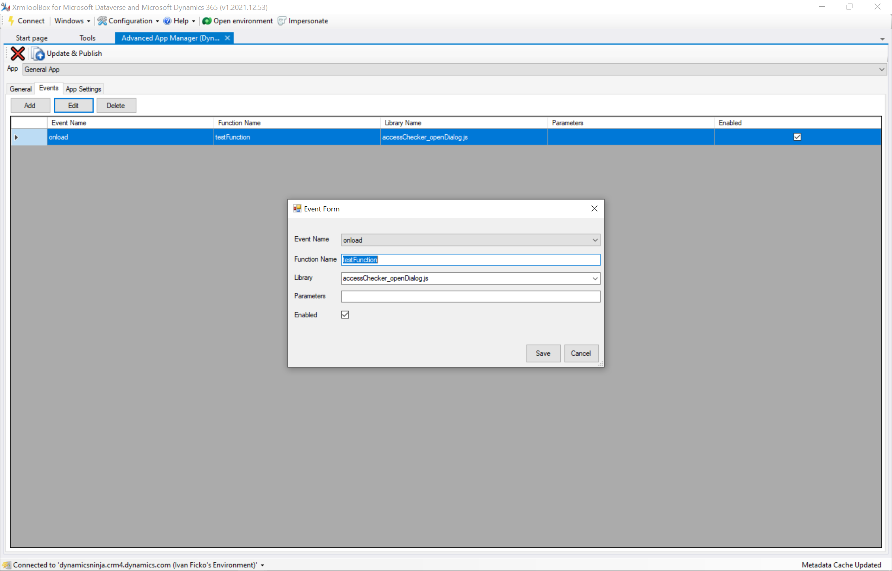

# Advanced App Manager for [XrmToolBox](http://www.xrmtoolbox.com)

 

XrmToolBox tool that provieds you with advanced model driven app customizations.

## Preview

## Features

### Editing general info

Edit general information of an app like name, description, icon and security roles.

### Adding/Editing Events

Add Javascript events to your app. Only on load event is currently supported.

### Manage App Settings

Manage application level settings that are not exposed via UI.

